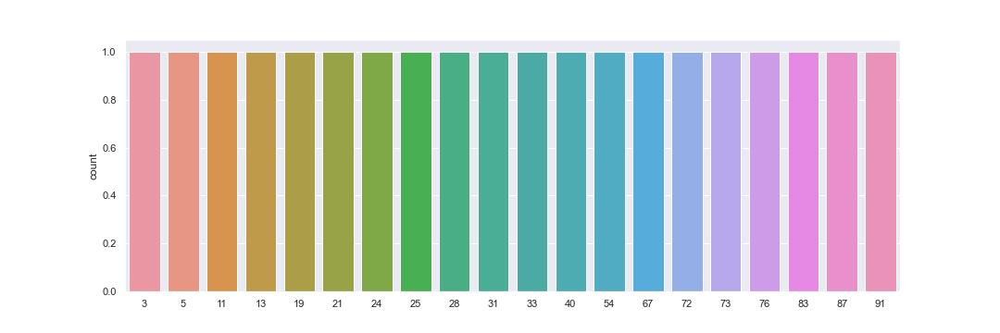
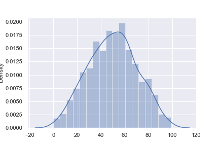
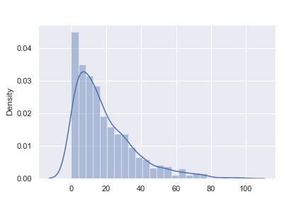
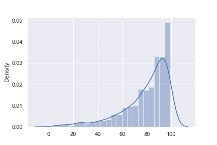

# Samplegen

Generate repetitive samples of the values in your data following some distribution:
- [x] Random Uniform
 

- [x] Random Normal
 

- [x] Left Skew (gamma)
 

- [x] Right Skew (inverse gamma)
 

Weight of the data distribution will be given according to the order of the values in the data
